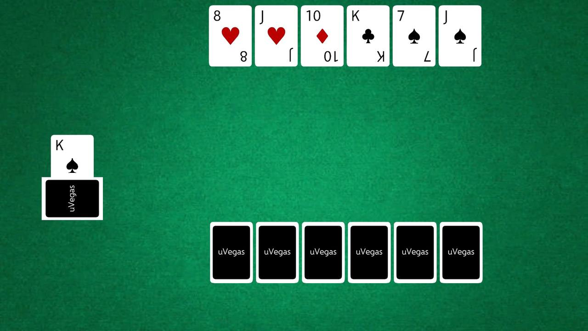
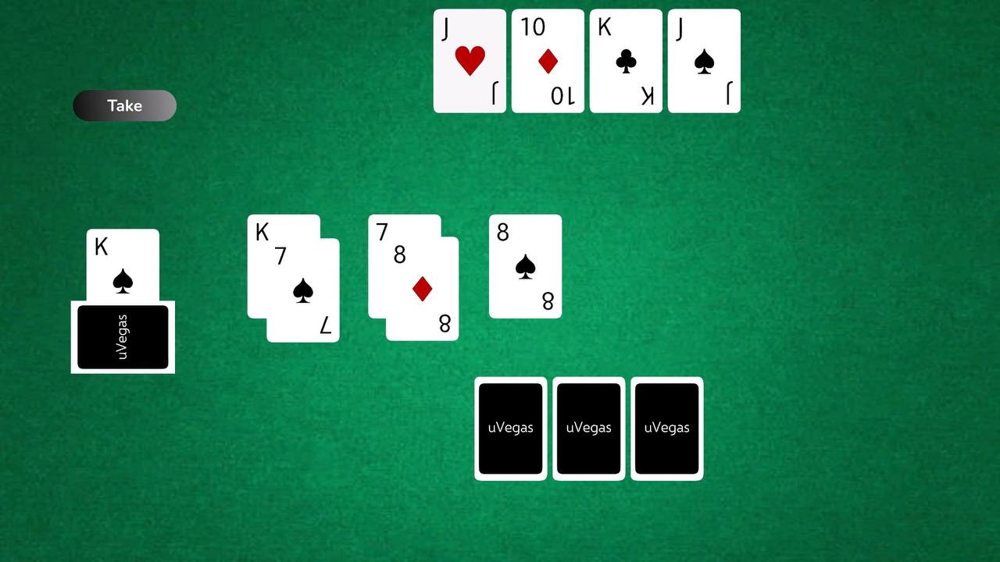
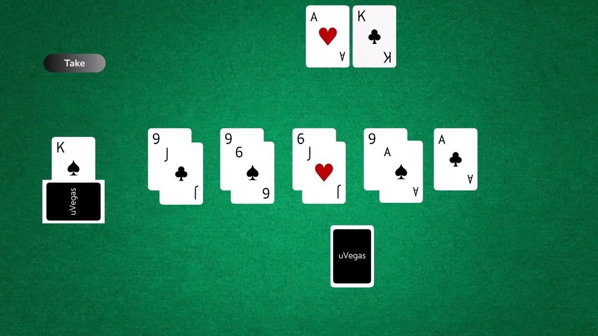
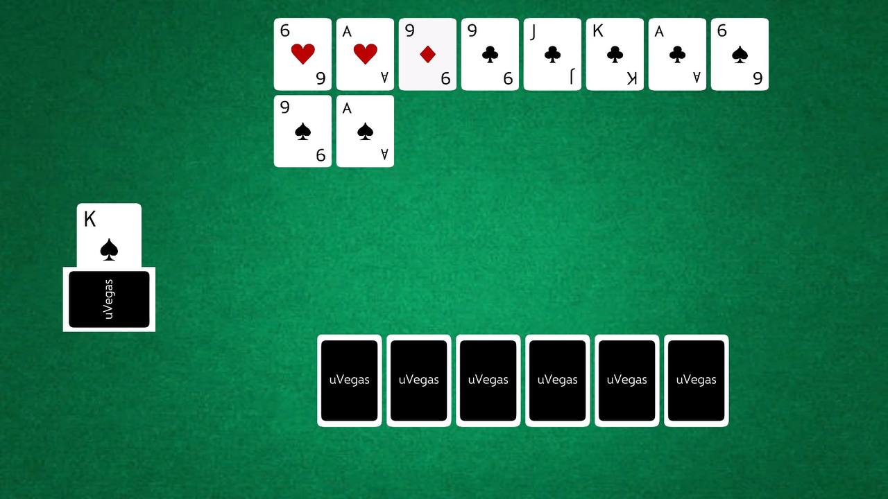
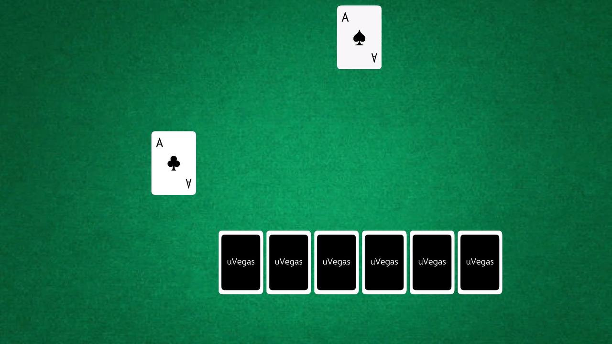
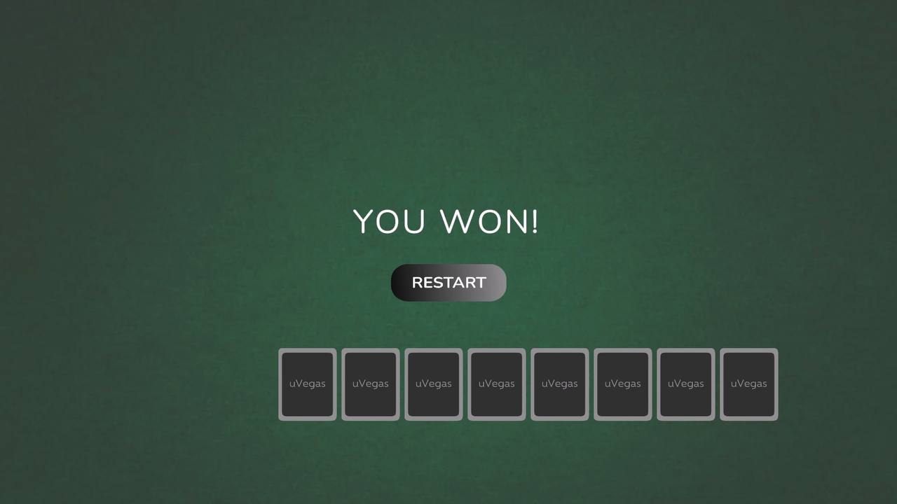

# Durak Card Game

A digital implementation of the classic card game **Durak**, built with **Unity** and **C#**.

This project recreates the complete gameplay loop of the traditional game, including attacking, defending, trump card mechanics, AI opponent behaviour, turn management, automatic card replenishment, and game-over detection.

---

## Screenshot

  
  
  
  
  
  

---

## Gameplay

The player competes against a rule-based AI opponent.

The game follows the original Durak rules:

- Shuffle and deal the deck.
- Determine the trump suit.
- Attack using a valid card.
- Defend with a higher card or a trump card.
- Take cards if defence is impossible.
- Replenish both hands after each round.
- Continue until one player runs out of cards.

---

## Features

- Classic Durak gameplay
- Rule-based AI opponent
- Trump card mechanics
- Turn-based gameplay
- Automatic deck shuffling and dealing
- Automatic hand replenishment
- Responsive card layout
- Win/Lose screen
- Restart functionality

---

## Technologies

- Unity
- C#
- Unity UI
- Object-Oriented Programming (OOP)

---

## Project Structure

The project is organised into several scripts responsible for different parts of the gameplay.

### GameManager

Controls the main round logic and card validation.

It is responsible for:

- tracking the active player;
- placing cards on the table;
- checking whether a card can be added to the current attack;
- validating defence according to suit, rank, and trump rules;
- switching turns;
- clearing the table after a round;
- starting the card replenishment process.

---

### CardsManager

Manages the deck, cards in each hand, and the end of the game.

It is responsible for:

- shuffling the deck at the start of the game;
- dealing six cards to the player and the bot;
- creating UI card objects;
- selecting and displaying the trump card;
- removing played cards from hands;
- replenishing hands after a round;
- transferring table cards to a player's hand when cards are taken;
- detecting win and loss conditions;
- restarting the game scene.

---

### Player

Handles player input and player-hand UI behaviour.

It is responsible for:

- processing card selection;
- passing selected cards to the game logic;
- sorting cards in the player's hand;
- updating the order of cards in the UI;
- showing or hiding action buttons;
- taking cards from the table.

---

### Bot

Implements a simple rule-based opponent.

The bot:

- performs actions after a short delay;
- chooses a random card for the first attack;
- searches for valid cards that can be added to an attack;
- searches for the first available card that can beat the current card;
- takes the cards from the table when defence is not possible.

---

### ControlGridLayoutGroup

Adjusts the card layout based on the number of cards displayed. It dynamically changes the GridLayoutGroup cell size while keeping it within predefined minimum and maximum values.

---

## Key Learning Outcomes

During this project, I gained hands-on experience with:

- implementing turn-based card game logic;
- validating moves based on suit, rank, and trump rules;
- managing the game state across attack and defence phases;
- working with dynamic card collections using `List<T>`;
- implementing a simple rule-based bot;
- creating and updating UI card objects at runtime;
- connecting Unity UI buttons with gameplay logic;
- sorting and reorganising UI elements;
- managing scene restart and win/loss states.

---

## Author

**Maria Piili**

Unity Developer

- LinkedIn: www.linkedin.com/in/mariа-piili-49b71b17b
